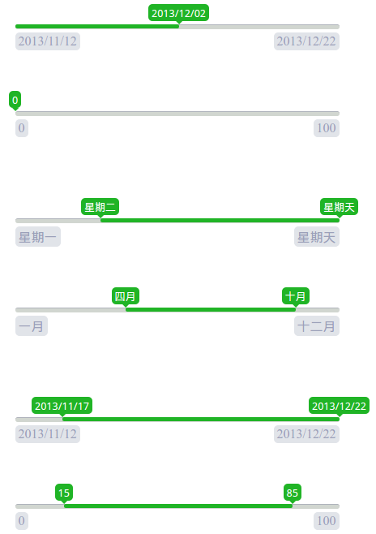

#range-picker
一个简单的Jquery范围选择插件

效果图
---


示例
---
1. 查看项目目录下的 `sample` 文件夹
2. [jsfiddle示例](https://jsfiddle.net/cqmyg/me1dmz9e/2/)

使用
---

###引入css

```html
<!-- 注意: 请替换为自己的文件路径 -->
<link rel="stylesheet" href="../css/range-picker.css" type="text/css" charset="utf-8" />

```

###引入javascript

```html
<!-- 注意: 请替换为自己的文件路径 -->
<script src="../bower_components/jquery/dist/jquery.js" type="text/javascript" charset="utf-8"></script>
<script src="../src/range_picker.js" type="text/javascript" charset="utf-8"></script>

```
###调用
```javascript
$("#date_picker").rangepicker();
```

参数
---

####startValue

默认值: 无

必须: 是

选择插件的左下角的标签, 如"2016-01-03"

####endValue

默认值: 无

必须: 是

插件右下角的标签, 如 "2016-03-12"


####translateSelectLabel

类型: `Function`

默认值: 无

######参数
1. `currentPosition` 游标的当前位置
2. `totalWidth` 整个进度条的宽度

用于获取进度条上面滑动游标的文本内容的回调函数


例子
```js
$("#number_range").rangepicker({
    startValue: 0,
    endValue: 100,
    translateSelectLabel: function(currentPosition, totalPosition) {
        return parseInt(100 * (currentPosition / totalPosition));
    }
});
```

方法
---

####getSelectValue

获取所选择范围值的回调函数


编译和测试
---

###搭建环境

######安装 `grunt` 和 `bower`

######克隆项目
```
git clone https://git.oschina.net/syjefbz/range-picker.git
```

######下载依赖包
```
// 在项目目录下运行
bower install
npm install
```

###编译
```
grunt
```

###运行测试
```
grunt test
```
